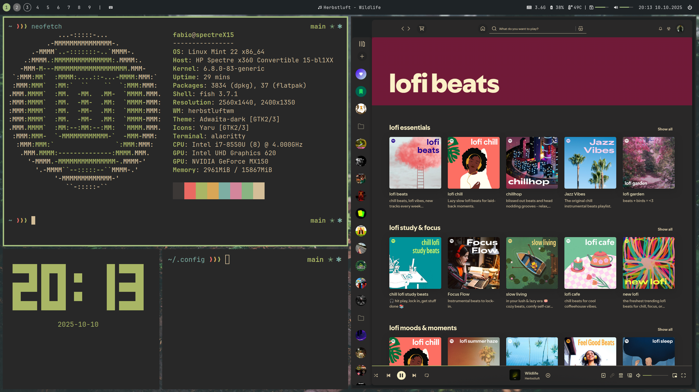
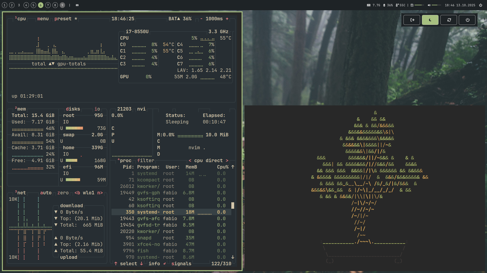
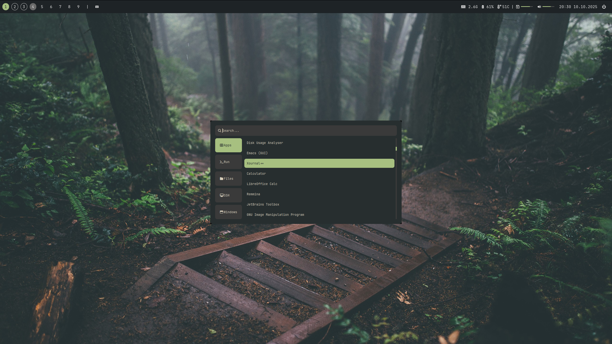
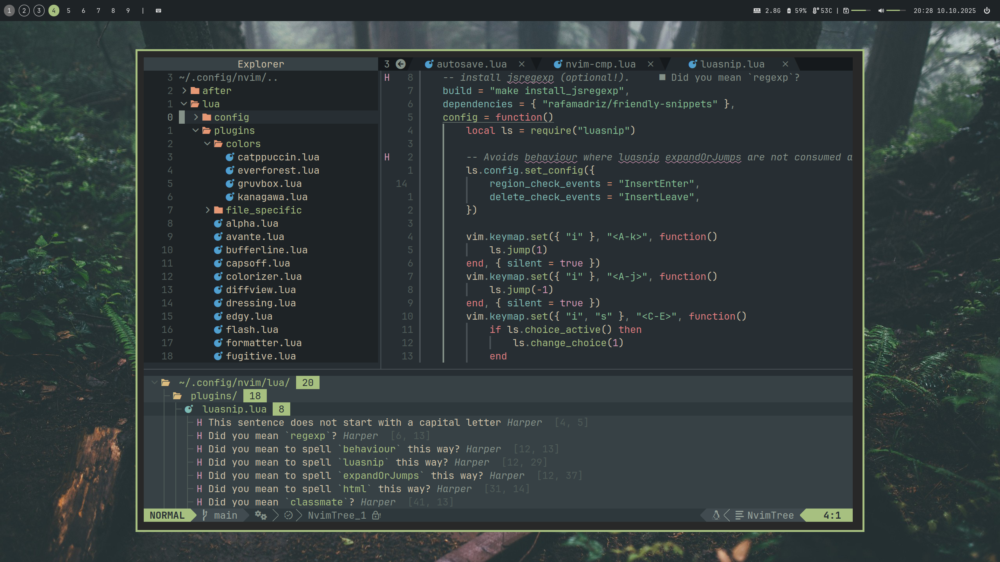
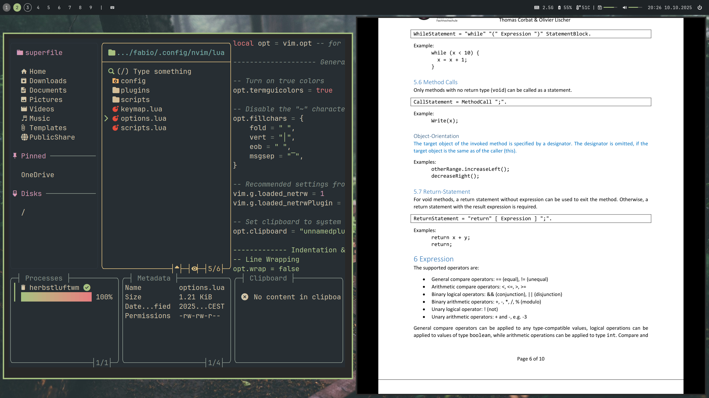
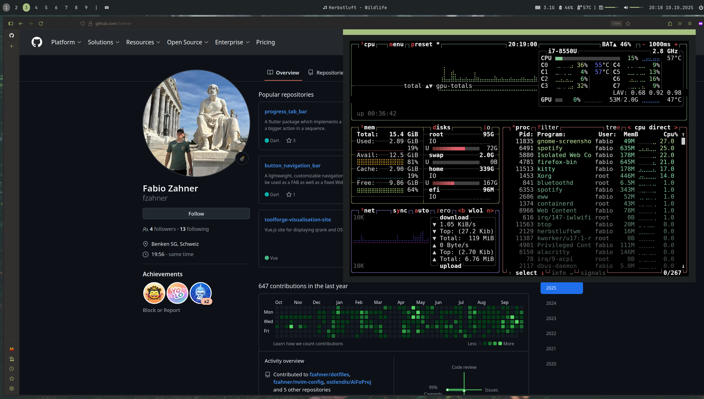

# My Linux Desktop Dotfiles



My collection of dotfiles with Herbstluftwm window manager and Neovim config, as well as multiple other small files. I am running Linux Mint as my OS, but the config should work regardless of installed Operating System.

> [!IMPORTANT]
> To use the herbstluftwm config, supporting software is needed. See `herbstluftwm/README.md` for more information.

## Usage with Chezmoi

1. Install [chezmoi](https://www.chezmoi.io/):
2. Apply dotfiles:

```bash
chezmoi init https://github.com/fzahner/dotfiles.git
chezmoi apply -v
```

3. Update changes:

```bash
chezmoi cd
git add . && git commit -m "update" && git push
```

## Features

- Productivity focused setup for school and work
- Lightweight and performant desktop environement
- [Everforest](https://github.com/sainnhe/everforest)/[Gruvbox Material](https://github.com/sainnhe/gruvbox-material) based colors (green and dark) have been used throughout: In window manager, widgets, neovim, superfile file explorer, spotify, ...

### Desktop Environment



- Herbstluftwm tiling window manager with custom layouts
- Eww widgets for bar with tag and system resources overviews
- Rofi Application Launcher with SSH and window functionality



### Neovim IDE



- Out-of-the-box functionality for many languages: Python, JS/TS, Go, HTML/CSS, Lua, Tex, Rust, ...
- Lazy-Loaded Plugins to ensure quick startup times

### Other notable Programs

- **Terminal:**
  - Alacritty & Kitty configurations
  - Fish shell configuration
- **File Manager:** Superfile with custom vim-based keybinds and gruvbox colorscheme.

## More Screenshots




